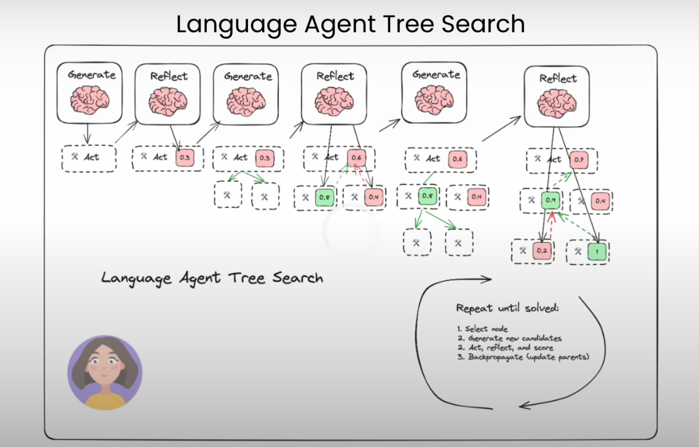
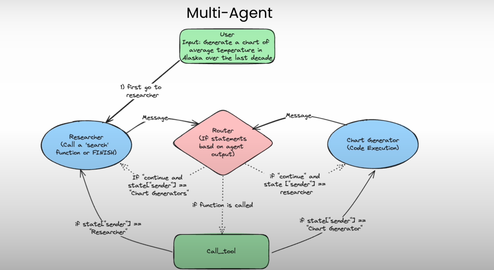
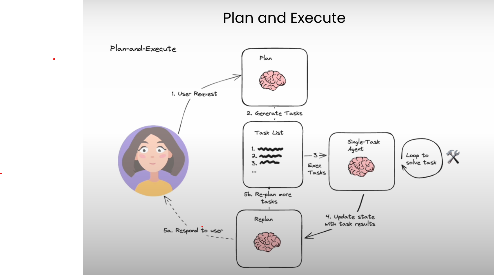
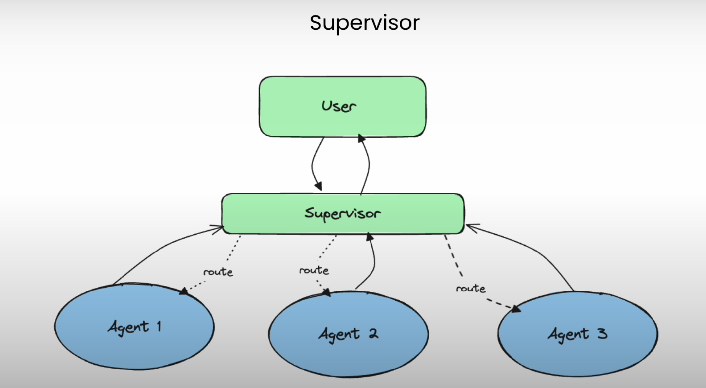

# [Agentic LLM Workflows](https://learn.deeplearning.ai/courses/ai-agents-in-langgraph/lesson/)

This project focuses on building agentic LLM workflows with two common architectures: **ReAct (Reason+Action)** and **Self-Refine (Iterative refinement with self-feedback)**.

## Key Features

1. **Human in the Loop**: Our setup includes human inputs in the loop.
2. **Persistence Store**: We use a persistence store to backtrack to states for our convenience.

Within the prompt itself, we instruct the model to perform and redirect itself to perform next steps. Persistence is beneficial for having multiple conversations simultaneously while keeping track of previous actions.

## Graphs in Tavily

Our graphs contain:
- Nodes as agents or functions
- Edges connecting nodes
- Conditional edges for conditional execution

## [Regular Search vs Agentic Search](https://www.analyticsvidhya.com/blog/2024/05/agentic-ai-demystified-the-ultimate-guide-to-autonomous-agents/)

Traditional AI systems are designed primarily to automate specific, repetitive tasks, enhancing speed and efficiency within a confined scope. However, they fall short in handling complex workflows that require holistic understanding and strategic judgment. 

Agentic AI, leveraging advancements such as large language models (LLMs), scalable computing power, and vast datasets, offers a more dynamic and flexible approach. It introduces a layer of intelligence by employing AI agents. These agents act as autonomous decision-makers, analyzing initial findings and strategically selecting the most effective tools for further data retrieval.

## Building Agentic Workflows

While building agentic workflows, we follow two main concepts:
- **Persistence**: To keep track of previous states
- **Streaming**: To keep track of the current state by emitting a list of signals of what is going on at that exact moment.

We use thread config to keep track of threads inside the persistent checkpoint. This allows us to have multiple conversations at the same time.

## Project Workflow

## Human In Loop Architectures

Below are some of the architectures we use:

.png)

